[](https://travis-ci.org/hrbrmstr/albersusa)

`albersusa` : Tools, Shapefiles & Data to Work with an 'AlbersUSA' Composite Projection

The following functions are implemented:

-   `counties_sf`: Retreive a U.S. county composite map, optionally with a projection, as a simplefeature
-   `usa_sf`: Retreive a U.S. state composite map, optionally with a projection, as a simplefeature

New ones:

-   `points_elided`: Shift points around Alaska and Hawaii to the elided area (by @rdinter)

Some legacy ones:

-   `usa_composite`: Retreive a U.S. composite map, optionally with a projection
-   `counties_composite`: Retreive a U.S. county composite map, optionally with a projection

Pre-canned projection strings:

-   `us_aeqd_proj`: Oblique azimuthal equidistant convenience projection
-   `us_eqdc_proj`: Equidistant conic convenience projection
-   `us_laea_proj`: Albers equal-area conic convenience projection
-   `us_lcc_proj`: Lambert conformal conic convenience projection
-   `us_longlat_proj`: Generic long/lat convenience projection

The following data sets are included:

-   `system.file("extdata/composite_us_states.geojson.gz", package="albersusa")`
-   `system.file("extdata/composite_us_counties.geojson.gz", package="albersusa")`

Also, the simplefeatures coluns and `@data` slot of each `SpatialPolygonsDataFrame` has some handy data you can use (like FIPS codes and state/county population information).

### Installation

``` r
devtools::install_github("hrbrmstr/albersusa")
```

### Usage

``` r
library(albersusa)
library(sf)
library(sp)
library(rgeos)
library(maptools)
library(ggplot2)
library(ggalt)
library(ggthemes)
library(viridis)
library(scales)

# current verison
packageVersion("albersusa")
```

    ## [1] '0.3.0'

### Simple features

``` r
par(mar=c(0,0,1,0))

us_sf <- usa_sf("laea")
plot(us_sf["pop_2012"])
```

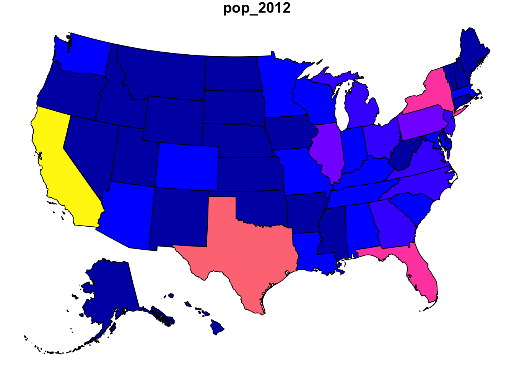

``` r
cty_sf <- counties_sf("aeqd")
plot(cty_sf["census_area"])
```

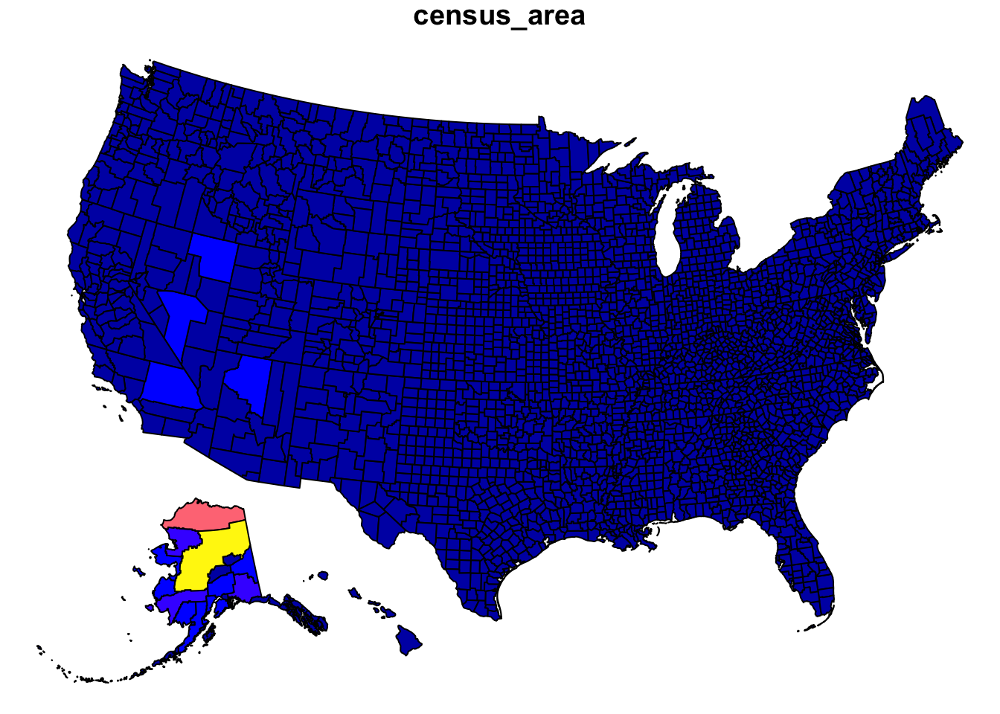

### Legacy

``` r
us <- usa_composite()

dplyr::glimpse(us@data)
```

    ## Observations: 51
    ## Variables: 13
    ## $ geo_id              <chr> "0400000US04", "0400000US05", "0400000US06", "0400000US08", "0400000US09", "0400000US11...
    ## $ fips_state          <chr> "04", "05", "06", "08", "09", "11", "13", "17", "18", "22", "27", "28", "30", "35", "38...
    ## $ name                <chr> "Arizona", "Arkansas", "California", "Colorado", "Connecticut", "District of Columbia",...
    ## $ lsad                <chr> "", "", "", "", "", "", "", "", "", "", "", "", "", "", "", "", "", "", "", "", "", "",...
    ## $ census_area         <dbl> 113594.084, 52035.477, 155779.220, 103641.888, 4842.355, 61.048, 57513.485, 55518.930, ...
    ## $ iso_3166_2          <chr> "AZ", "AR", "CA", "CO", "CT", "DC", "GA", "IL", "IN", "LA", "MN", "MS", "MT", "NM", "ND...
    ## $ census              <int> 6392017, 2915918, 37253956, 5029196, 3574097, 601723, 9687653, 12830632, 6483802, 45333...
    ## $ pop_estimataes_base <int> 6392310, 2915958, 37254503, 5029324, 3574096, 601767, 9688681, 12831587, 6484192, 45334...
    ## $ pop_2010            <int> 6411999, 2922297, 37336011, 5048575, 3579345, 605210, 9714464, 12840097, 6490308, 45455...
    ## $ pop_2011            <int> 6472867, 2938430, 37701901, 5119661, 3590537, 620427, 9813201, 12858725, 6516560, 45759...
    ## $ pop_2012            <int> 6556236, 2949300, 38062780, 5191709, 3594362, 635040, 9919000, 12873763, 6537632, 46047...
    ## $ pop_2013            <int> 6634997, 2958765, 38431393, 5272086, 3599341, 649111, 9994759, 12890552, 6570713, 46292...
    ## $ pop_2014            <int> 6731484, 2966369, 38802500, 5355866, 3596677, 658893, 10097343, 12880580, 6596855, 4649...

``` r
plot(us, lwd=0.25)
```

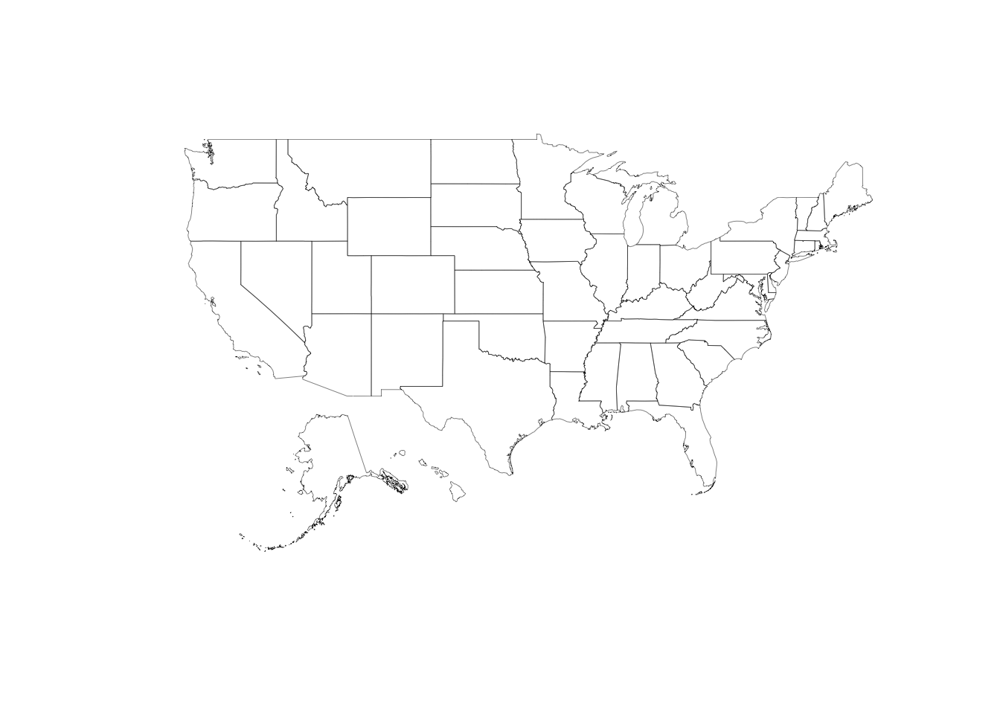

``` r
us <- usa_composite("laea")
plot(us, lwd=0.25)
```

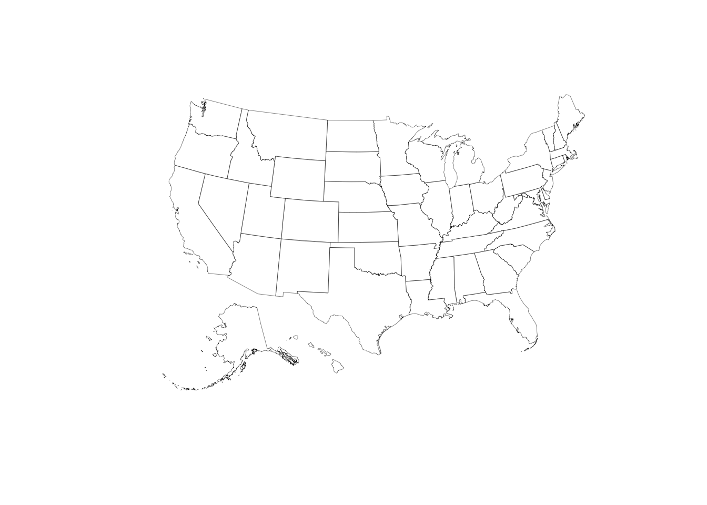

``` r
us <- usa_composite()
us_map <- fortify(us, region="name")

gg <- ggplot()
gg <- gg + geom_map(data=us_map, map=us_map,
                    aes(x=long, y=lat, map_id=id),
                    color="#2b2b2b", size=0.1, fill=NA)
gg <- gg + theme_map()

gg + coord_map()
```


``` r
gg + coord_map("polyconic")
```

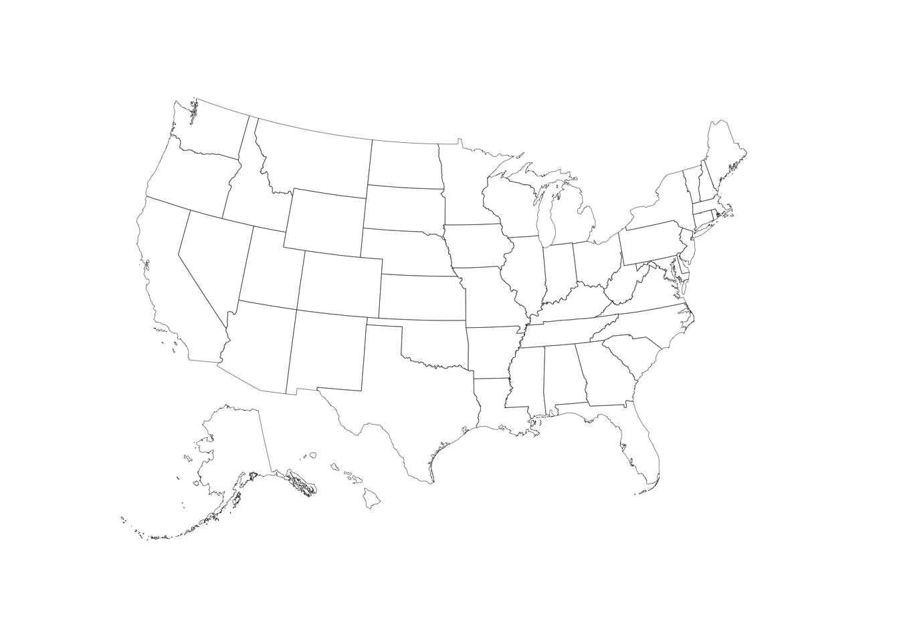

``` r
gg + coord_proj()
```

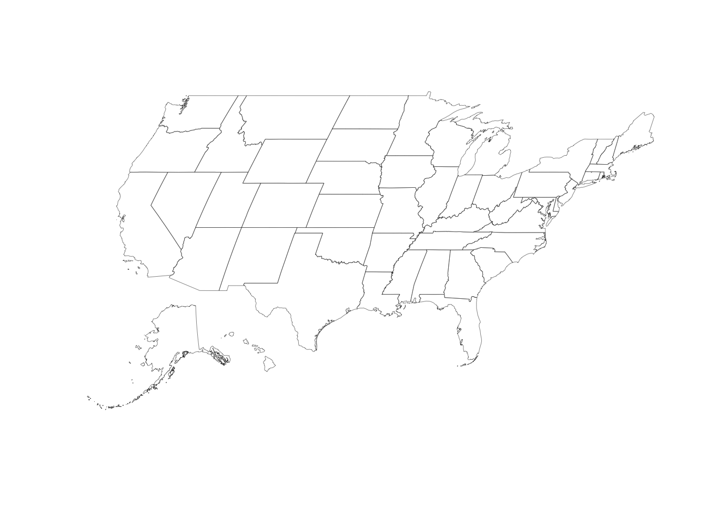

``` r
gg + coord_proj(us_laea_proj)
```


``` r
gg + coord_proj(us_aeqd_proj)
```

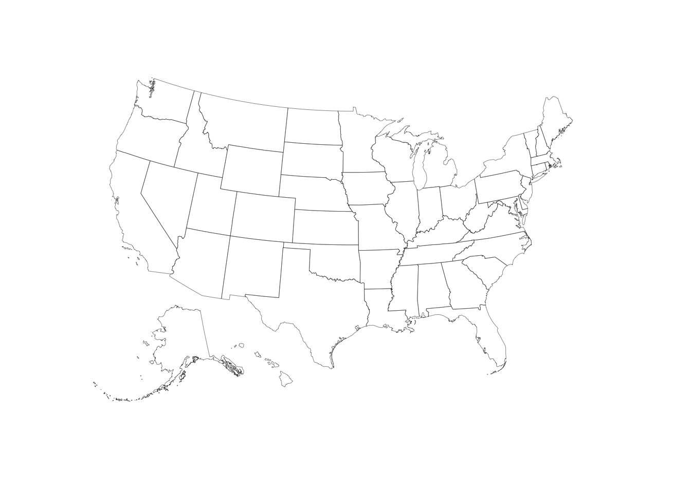

``` r
gg + coord_proj(us_eqdc_proj)
```


``` r
gg + coord_proj(us_lcc_proj)
```

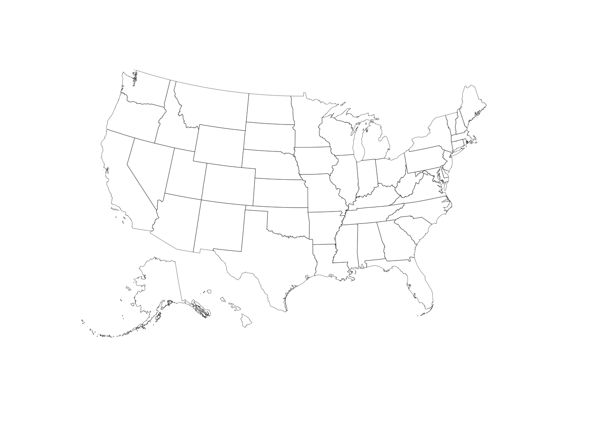

``` r
gg + 
  geom_map(data=us@data, map=us_map,
           aes(fill=pop_2014, map_id=name),
           color="white", size=0.1) +
  coord_proj(us_laea_proj) +
  scale_fill_viridis(name="2014 Populaton Estimates", labels=comma) +
  theme(legend.position="top", 
        legend.key.width=unit(3, "lines"))
```

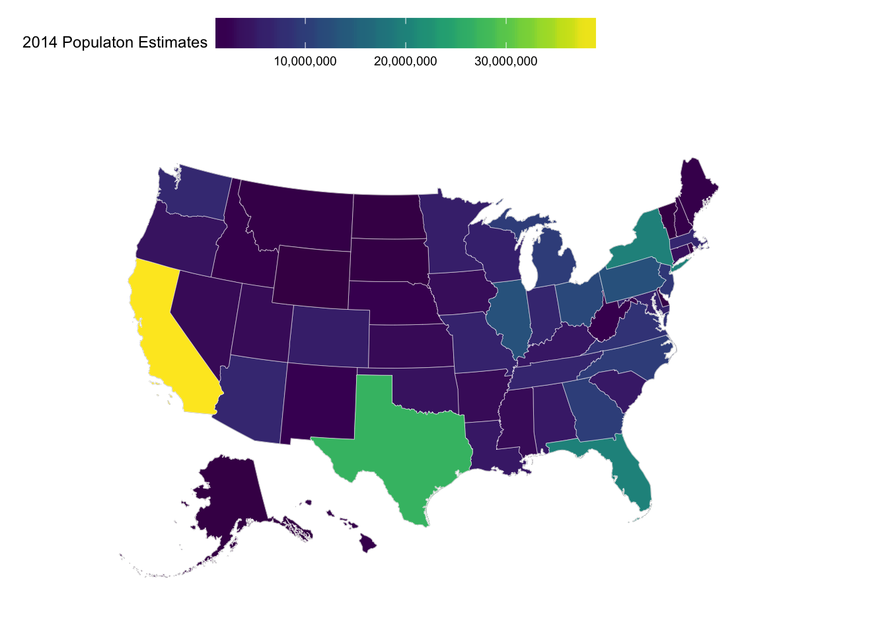

``` r
us <- counties_composite()

dplyr::glimpse(us@data)
```

    ## Observations: 3,143
    ## Variables: 8
    ## $ fips        <chr> "01001", "01009", "01017", "01021", "01033", "01045", "01051", "01065", "01079", "01083", "0109...
    ## $ state_fips  <chr> "01", "01", "01", "01", "01", "01", "01", "01", "01", "01", "01", "01", "01", "05", "05", "06",...
    ## $ county_fips <chr> "001", "009", "017", "021", "033", "045", "051", "065", "079", "083", "099", "107", "121", "141...
    ## $ name        <chr> "Autauga", "Blount", "Chambers", "Chilton", "Colbert", "Dale", "Elmore", "Hale", "Lawrence", "L...
    ## $ lsad        <chr> "County", "County", "County", "County", "County", "County", "County", "County", "County", "Coun...
    ## $ census_area <dbl> 594.436, 644.776, 596.531, 692.854, 592.619, 561.150, 618.485, 643.943, 690.678, 559.936, 1025....
    ## $ state       <chr> "Alabama", "Alabama", "Alabama", "Alabama", "Alabama", "Alabama", "Alabama", "Alabama", "Alabam...
    ## $ iso_3166_2  <chr> "AL", "AL", "AL", "AL", "AL", "AL", "AL", "AL", "AL", "AL", "AL", "AL", "AL", "AR", "AR", "CA",...

``` r
plot(us, lwd=0.25)
```

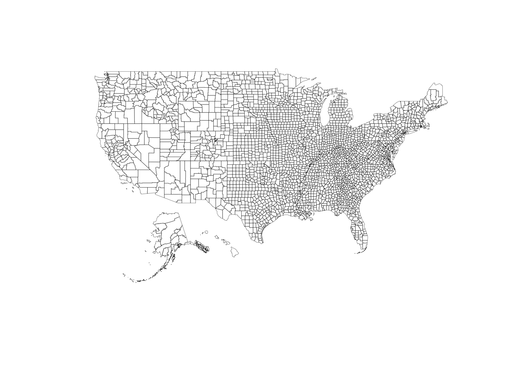

``` r
us <- counties_composite("laea")
plot(us, lwd=0.25)
```


``` r
us <- counties_composite()
us_map <- fortify(us, region="fips")

gg <- ggplot()
gg <- gg + geom_map(data=us_map, map=us_map,
                    aes(x=long, y=lat, map_id=id),
                    color="#2b2b2b", size=0.1, fill=NA)
gg <- gg + theme_map()

gg + coord_map()
```


``` r
gg + coord_map("polyconic")
```


``` r
gg + coord_proj()
```

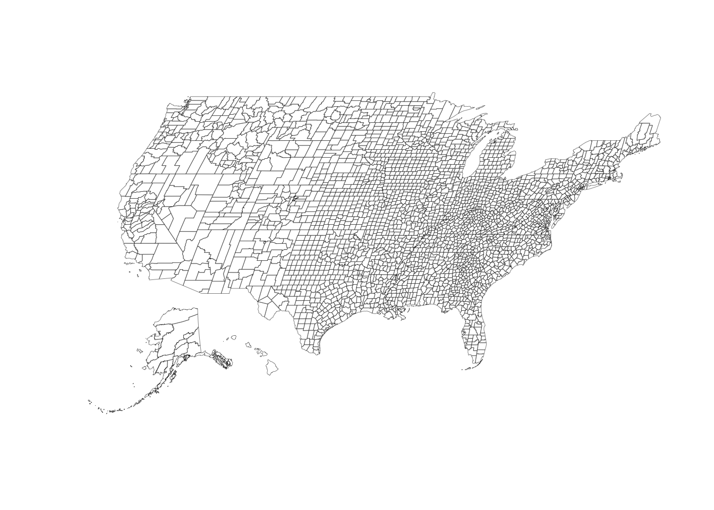

``` r
gg + coord_proj(us_laea_proj)
```

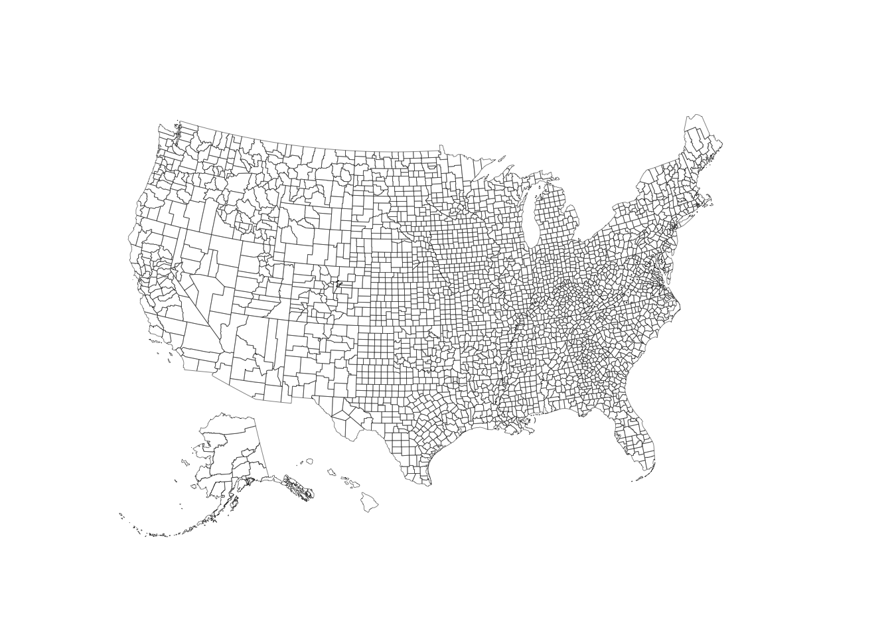

``` r
gg + coord_proj(us_aeqd_proj)
```


``` r
gg + coord_proj(us_eqdc_proj)
```

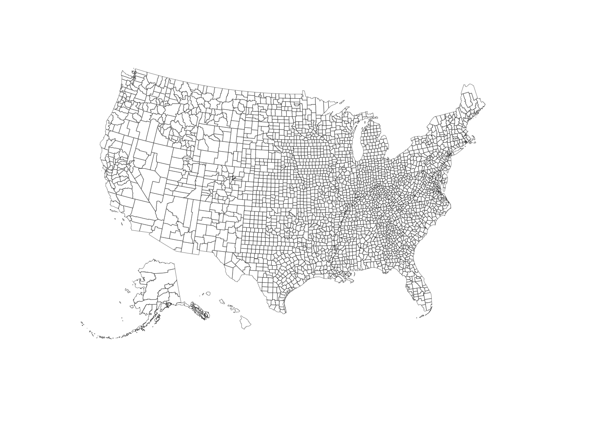

``` r
gg + coord_proj(us_lcc_proj)
```


### Test Results

``` r
library(albersusa)
library(testthat)

date()
```

    ## [1] "Thu Jan 26 23:57:29 2017"

``` r
test_dir("tests/")
```

    ## testthat results ========================================================================================================
    ## OK: 6 SKIPPED: 0 FAILED: 0
    ## 
    ## DONE ===================================================================================================================
