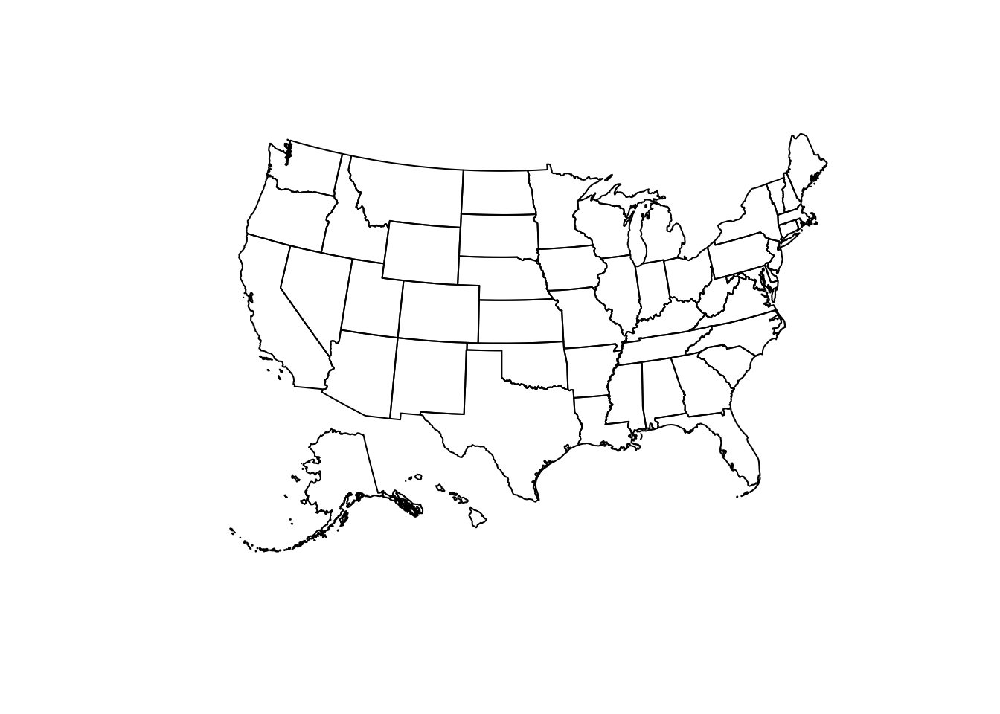
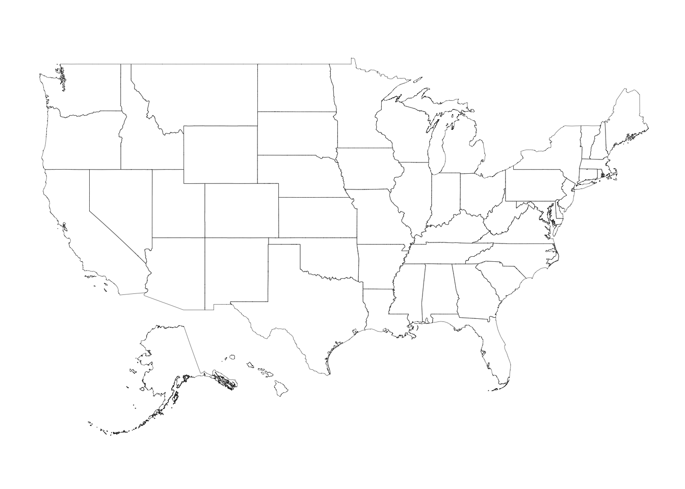
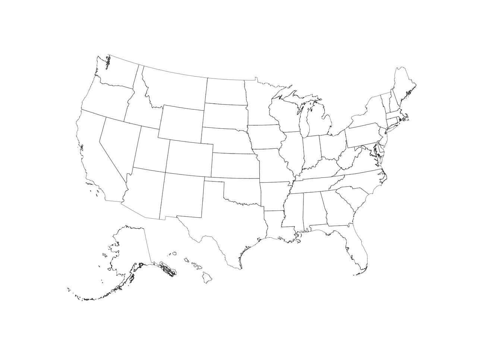
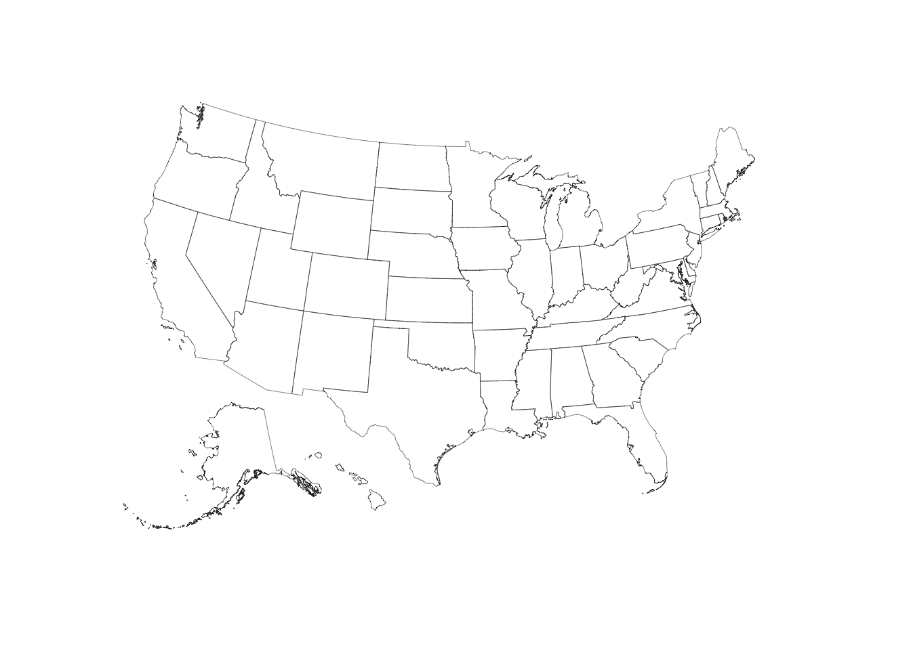
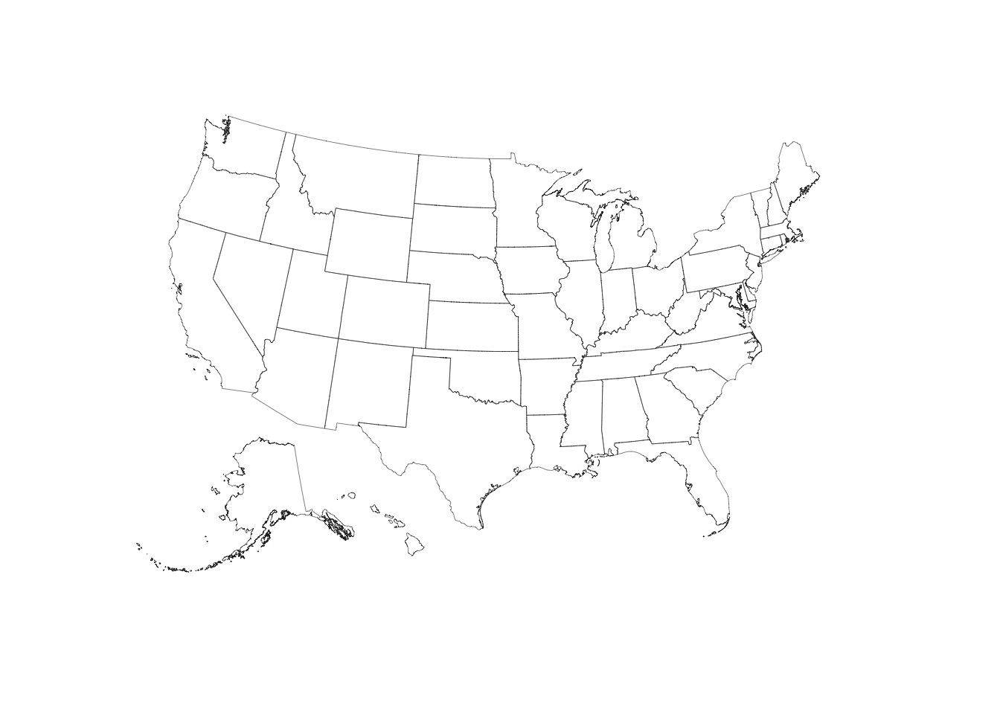

`albersusa` : Tools, Shapefiles & Data to Work with an 'AlbersUSA' Composite Projection

The following functions are implemented:

- `usa_composite`:	Retreive a U.S. composite map, optionally with a projection
- `us_aeqd_proj`:	Oblique azimuthal equidistant convenience projection
- `us_eqdc_proj`:	Equidistant conic convenience projection
- `us_laea_proj`:	Albers equal-area conic convenience projection
- `us_lcc_proj`:	Lambert conformal conic convenience projection
- `us_longlat_proj`:	Generic long/lat convenience projection

The following data sets are included:

- `system.file("extdata/composite_us_states.geojson", package="albersusa")` - composite GeoJSON

### Installation


```r
devtools::install_github("hrbrmstr/albersusa")
```


### Usage


```r
library(albersusa)
library(sp)
library(rgeos)
library(maptools)
library(ggplot2)
library(ggalt)
library(ggthemes)

# current verison
packageVersion("albersusa")
```

```
## [1] '0.1.0'
```

```r
us <- usa_composite()
plot(us)
```


```r
us <- usa_composite("laea")
plot(us)
```



```r
us <- usa_composite()
us_map <- fortify(us, region="NAME")

gg <- ggplot()
gg <- gg + geom_map(data=us_map, map=us_map,
                    aes(x=long, y=lat, map_id=id),
                    color="#2b2b2b", size=0.1, fill=NA)
gg <- gg + theme_map()

gg + coord_map()
```



```r
gg + coord_map("polyconic")
```



```r
gg + coord_proj()
```


```r
gg + coord_proj(us_laea_proj)
```


```r
gg + coord_proj(us_aeqd_proj)
```



```r
gg + coord_proj(us_eqdc_proj)
```



```r
gg + coord_proj(us_lcc_proj)
```


### Test Results


```r
library(albersusa)
library(testthat)

date()
```

```
## [1] "Mon Mar 28 16:25:47 2016"
```

```r
test_dir("tests/")
```

```
## testthat results ========================================================================================================
## OK: 0 SKIPPED: 0 FAILED: 0
```

