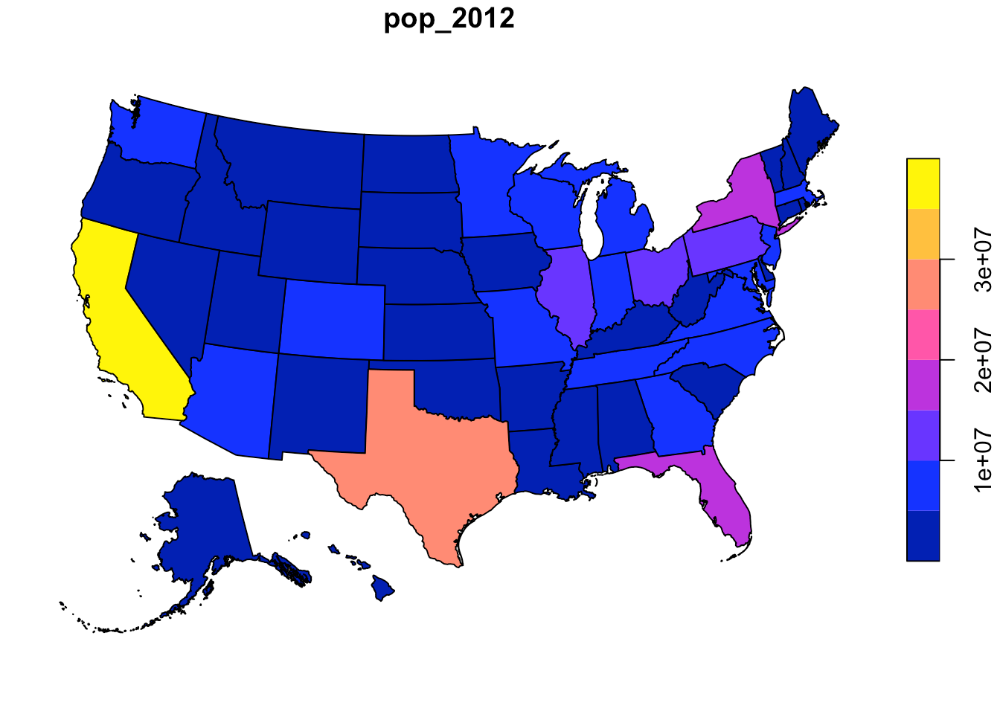
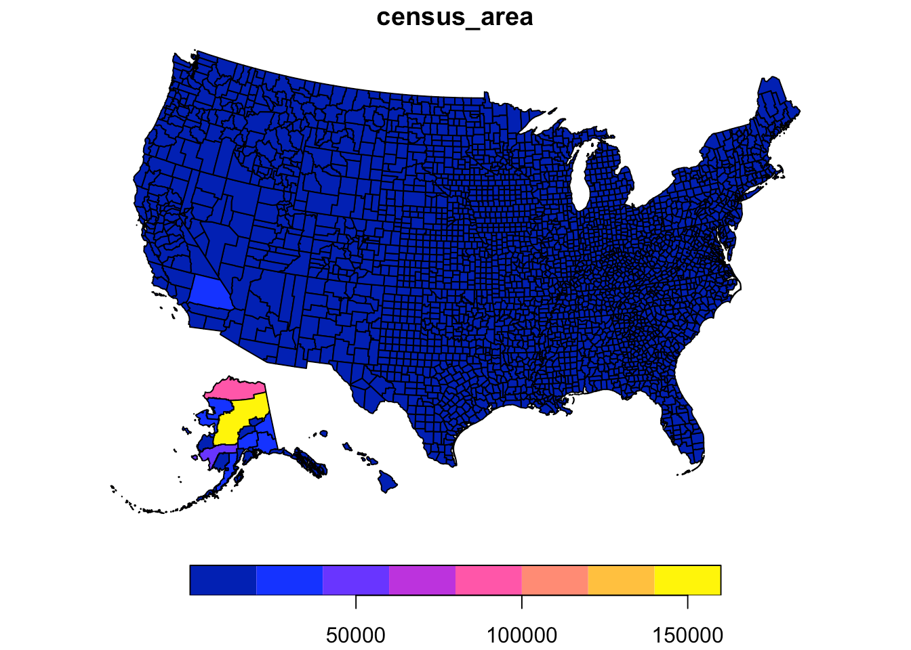
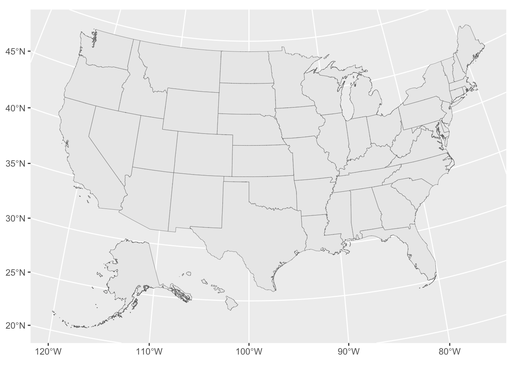
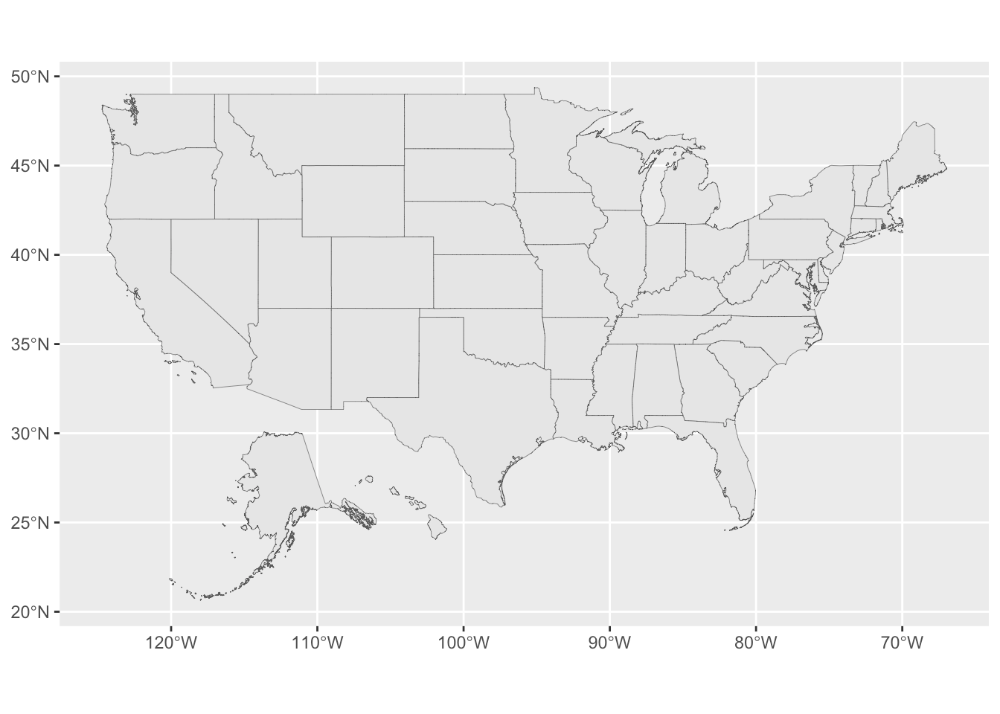
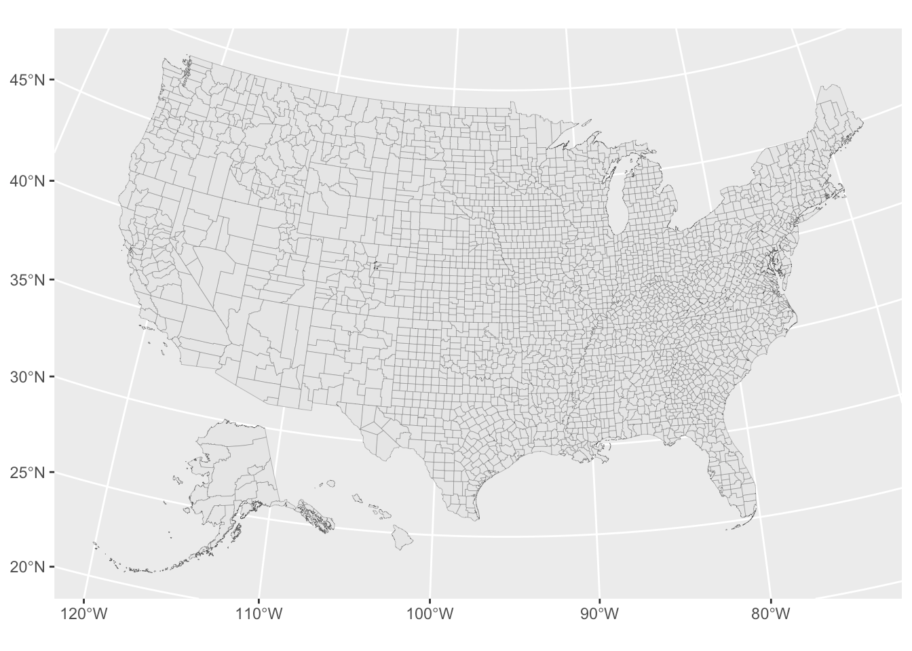
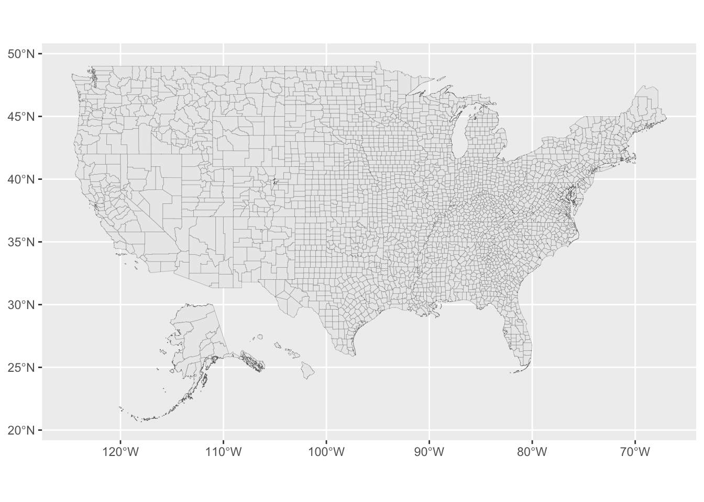

[](https://www.repostatus.org/#active)
[](https://keybase.io/hrbrmstr)

[](https://travis-ci.org/hrbrmstr/albersusa)
[](https://codecov.io/gh/hrbrmstr/albersusa)


# albersusa

Tools, Shapefiles & Data to Work with an ‘AlbersUSA’ Composite
Projection

## Description

Creating a composite projection for states and counties of the United
States that includes scaled and shifted polygons for Alaska and Hawaii
is time consuming and potentially error-prone. Functions and data sets
are provided to make it easier to produce maps with a composite
projection. Furthermore, named projections for common transormations are
provided to further increase mapping productivity.

## What’s Inside The Tin

The following functions are implemented:

  - `counties_sf`: Retrieve a U.S. county composite map, optionally with
    a projection, as a simplefeature
  - `usa_sf`: Retreive a U.S. state composite map, optionally with a
    projection, as a simplefeature

New ones:

  - `points_elided`: Shift points around Alaska and Hawaii to the elided
    area (by @rdinter)

Some legacy ones:

  - `usa_composite`: Retrieve a U.S. composite map, optionally with a
    projection
  - `counties_composite`: Retrieve a U.S. county composite map,
    optionally with a projection

Pre-canned projection strings:

  - `us_aeqd_proj`: Oblique azimuthal equidistant convenience projection
  - `us_eqdc_proj`: Equidistant conic convenience projection
  - `us_laea_proj`: Albers equal-area conic convenience projection
  - `us_lcc_proj`: Lambert conformal conic convenience projection
  - `us_longlat_proj`: Generic long/lat convenience projection

The following data sets are included:

  - `system.file("extdata/composite_us_states.geojson.gz",
    package="albersusa")`
  - `system.file("extdata/composite_us_counties.geojson.gz",
    package="albersusa")`

Also, the simplefeatures columns and `@data` slot of each
`SpatialPolygonsDataFrame` has some handy data you can use (like FIPS
codes and state/county population information).

## Installation

``` r
remotes::install_git("https://git.rud.is/hrbrmstr/albersusa.git")
# or
remotes::install_git("https://git.sr.ht/~hrbrmstr/albersusa")
# or
remotes::install_gitlab("hrbrmstr/albersusa")
# or
remotes::install_bitbucket("hrbrmstr/albersusa")
# or
remotes::install_github("hrbrmstr/albersusa")
```

NOTE: To use the ‘remotes’ install options you will need to have the
[{remotes} package](https://github.com/r-lib/remotes) installed.

## Usage

``` r
library(albersusa)
library(sf)
library(sp)
library(rgeos)
library(maptools)
library(ggplot2)
library(ggalt)
library(ggthemes)
library(viridis)
library(scales)

# current version
packageVersion("albersusa")
## [1] '0.4.0'
```

### Simple features base

``` r
par(mar=c(0,0,1,0))

us_sf <- usa_sf("laea")
plot(us_sf["pop_2012"])
```



``` r

cty_sf <- counties_sf("aeqd")
plot(cty_sf["census_area"])
```



### ggplot2

``` r
ggplot() +
  geom_sf(data = us_sf, size = 0.125)
```



``` r

ggplot() +
  geom_sf(data = us_sf, size = 0.125) +
  coord_sf(crs = us_longlat_proj)
```



``` r

ggplot() +
  geom_sf(data = cty_sf, size = 0.0725)
```



``` r

ggplot() +
  geom_sf(data = cty_sf, size = 0.0725) +
  coord_sf(crs = us_longlat_proj)
```



## albersusa Metrics

| Lang | \# Files | (%) | LoC |  (%) | Blank lines |  (%) | \# Lines |  (%) |
| :--- | -------: | --: | --: | ---: | ----------: | ---: | -------: | ---: |
| R    |        9 | 0.9 | 106 | 0.77 |          66 | 0.67 |      277 | 0.86 |
| Rmd  |        1 | 0.1 |  31 | 0.23 |          32 | 0.33 |       46 | 0.14 |

## Code of Conduct

Please note that this project is released with a Contributor Code of
Conduct. By participating in this project you agree to abide by its
terms.
